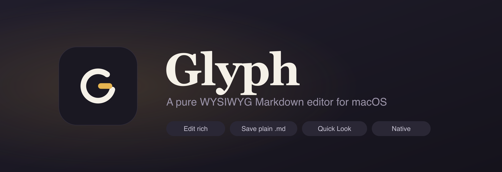
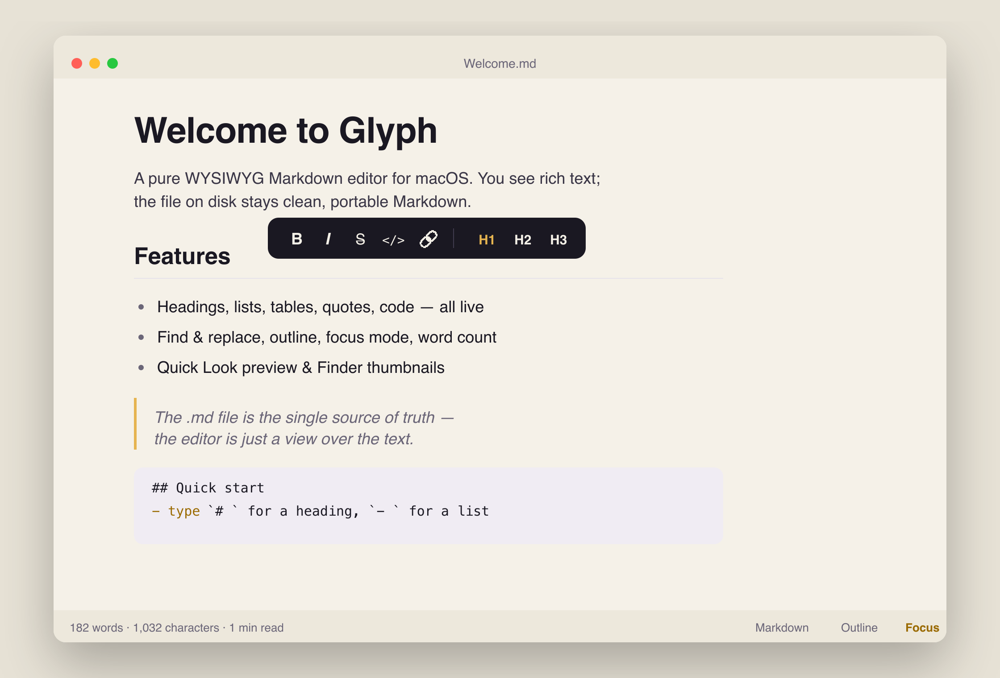

<p align="center">
  
</p>

<p align="center">
  <strong>Edit rich. Save plain.</strong><br>
  A native macOS Markdown editor with live rich-text editing — while the file on disk stays clean, portable Markdown.
</p>

<p align="center">
  <a href="https://github.com/paolobozzola/glyph/releases/latest"></a>
  
  
  
  <a href="https://www.buymeacoffee.com/paolobozzola"></a>
</p>

<p align="center">
  
</p>

---

## Why Glyph

Most Markdown tools make you choose: a raw-text editor with a separate preview, or a rich editor that saves its own proprietary format. **Glyph’s guiding principle is that the `.md` file is the single source of truth** — you edit rich, formatted text, and what lands on disk is plain, portable Markdown that any other tool can read. No lock-in, no proprietary blobs, no diff noise.

It’s a genuinely **native macOS app** (AppKit document model) wrapping a Markdown-first editing engine, so you get system tabs, autosave, Versions, Quick Look, printing, and the share sheet — alongside a fast, modern WYSIWYG canvas.

## Features

- **True WYSIWYG** — headings, bold/italic/strikethrough, lists & task lists, tables, block quotes, inline & fenced code, links, images, horizontal rules — all live (CommonMark + GFM).
- **Type or click** — Markdown input rules (`# `, `- `, `> `, ` ``` `), a selection toolbar with **H1/H2/H3**, and full native menu shortcuts.
- **Find & Replace** with match highlighting, in-editor.
- **Document outline**, live **word / character / reading-time** count, and a distraction-free **focus mode**.
- **Source ⇄ WYSIWYG** toggle for when you want the raw Markdown.
- **Editable YAML frontmatter** — front-matter shown as a properties panel, kept as plain YAML on save.
- **Images** paste or drag right in — saved beside your document and linked relatively.
- **Export** to standalone HTML or PDF.
- **macOS-native throughout** — document tabs, autosave-in-place + Versions, recent files, light/dark, spellcheck, printing, Share menu, and **Quick Look preview + Finder thumbnails**.
- **Private by design** — the editor runs fully offline; nothing leaves your Mac.

## Install

Glyph is distributed as a notarized, direct-download DMG (no sandbox → full filesystem access).

**[⬇︎ Download the latest release](https://github.com/paolobozzola/glyph/releases/latest)** — open `Glyph.dmg` and drag Glyph to **Applications**. macOS 15+.

> **Release candidate.** `v1.0.0-rc5` is feature-complete and notarized; expect minor polish before the final `v1.0.0`. Prefer to build it yourself? See [Build from source](#build-from-source) below.

## Build from source

Requirements: **Xcode 16+**, **Node 20+**, and [XcodeGen](https://github.com/yonsm/XcodeGen) (`brew install xcodegen`).

```sh
git clone https://github.com/paolobozzola/glyph.git
cd glyph
make run        # builds the editor bundle + app, then launches it
```

`make web` rebuilds just the editor bundle; `make open` opens the generated Xcode project. See [`docs/SETUP.md`](docs/SETUP.md) for details.

## How it’s built

| Layer | Choice |
|-------|--------|
| App shell | Swift + AppKit `NSDocument` (native tabs, autosave, Versions) |
| Editing engine | [Milkdown](https://milkdown.dev) (ProseMirror + remark) in a `WKWebView` |
| Markdown | CommonMark + GFM, faithful round-trip via remark |
| Quick Look | Preview renders with the editor's engine (read-only Milkdown) so it matches exactly; native thumbnails |
| Distribution | Developer ID, notarized, DMG |

Architecture and decisions are documented in [`CLAUDE.md`](CLAUDE.md) and [`docs/`](docs/).

## Roadmap

- 🚀 **v1.0** — *shipping now as [`v1.0.0-rc5`](https://github.com/paolobozzola/glyph/releases/latest)* — full editor, find/replace, outline, focus mode, export, images, frontmatter, Quick Look, notarized DMG. Final `v1.0.0` after release-candidate polish.
- 🔜 **v2.0** — richer content (code highlighting, LaTeX, slash menu, diagrams), command palette & templates, theming, macOS integration (Spotlight, Shortcuts), and Sparkle auto-updates. See [`docs/V2.md`](docs/V2.md).

## Support

Glyph is built and maintained by one person. If it’s useful to you, you can support its development:

<a href="https://www.buymeacoffee.com/paolobozzola">
  
</a>

## License

© 2026 Paolo Bozzola. All rights reserved.
